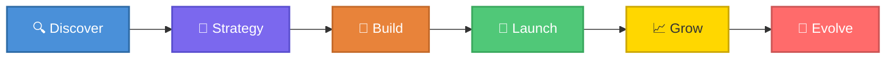
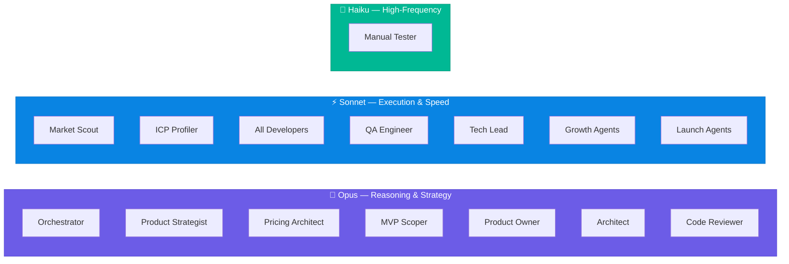
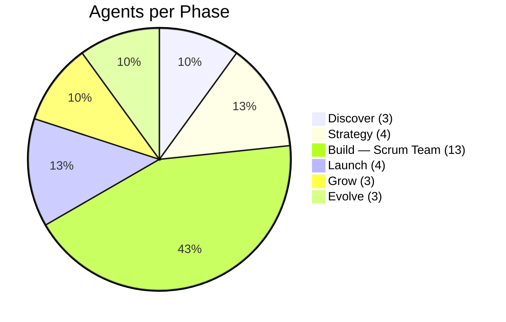

# Product Lifecycle (PLC) Framework

> Full-cycle product pipeline — 20+ agents across 6 phases, from raw concept to profitable business.

---

## Pipeline Overview

---

## Phase Details & Agent Map

```mermaid
graph TB
    subgraph ORCH["🎯 PLC Orchestrator (Opus) — coordinates all phases"]
        direction TB

        subgraph DISCOVER["Phase 1 · DISCOVER"]
            direction LR
            MS["🔍 Market Scout"]
            ICP["👤 ICP Profiler"]
            VA["✅ Validation Agent"]
        end

        subgraph STRATEGY["Phase 2 · STRATEGY"]
            direction LR
            PS["📋 Product Strategist"]
            RP["🗺️ Roadmap Planner"]
            PA["💰 Pricing Architect"]
            MVP["🎯 MVP Scoper"]
        end

        subgraph BUILD["Phase 3 · BUILD"]
            direction TB
            subgraph PLAN_ROW["Planning"]
                direction LR
                PO["📝 Product Owner"]
                UX["🎨 UX Designer"]
                AR["🏗️ Architect"]
            end
            subgraph TASK_ROW["Task Management"]
                direction LR
                SM["📊 Scrum Master"]
                TL["⚙️ Tech Lead"]
            end
            subgraph DEV_ROW["Development"]
                direction LR
                FE["💻 Frontend Dev"]
                BE["🖥️ Backend Dev"]
                CR["🔎 Code Reviewer"]
            end
            subgraph QA_ROW["Quality Assurance"]
                direction LR
                QE["📋 QA Engineer"]
                MT["🧪 Manual Tester"]
                QA["🤖 QA Automation"]
            end
            subgraph MOCK_ROW["Mockups"]
                direction LR
                MD["🖼️ Mockup Designer"]
                MV["✔️ Mockup Validator"]
            end
            PLAN_ROW --> TASK_ROW --> DEV_ROW --> QA_ROW
            PLAN_ROW --> MOCK_ROW
        end

        subgraph LAUNCH["Phase 4 · LAUNCH"]
            direction LR
            AN["📊 Analytics Agent"]
            CO["✍️ Copy Agent"]
            DI["📢 Distribution Agent"]
            RE["💵 Revenue Agent"]
        end

        subgraph GROW["Phase 5 · GROW"]
            direction LR
            GH["🚀 Growth Hacker"]
            RET["🔁 Retention Engineer"]
            SEO["📝 SEO Content Agent"]
        end

        subgraph EVOLVE["Phase 6 · EVOLVE"]
            direction LR
            FI["💡 Feature Inventor"]
            CI["🕵️ Competitive Intel"]
            CV["🗣️ Customer Voice"]
        end

        DISCOVER --> STRATEGY
        STRATEGY --> BUILD
        BUILD --> LAUNCH
        LAUNCH --> GROW
        GROW --> EVOLVE
    end

    style ORCH fill:#1a1a2e,stroke:#16213e,color:#eee
    style DISCOVER fill:#4A90D9,stroke:#2E6BA6,color:#fff
    style STRATEGY fill:#7B68EE,stroke:#5A4FCF,color:#fff
    style BUILD fill:#E8833A,stroke:#C46A2A,color:#fff
    style LAUNCH fill:#50C878,stroke:#3AA85E,color:#fff
    style GROW fill:#FFD700,stroke:#CCA700,color:#333
    style EVOLVE fill:#FF6B6B,stroke:#CC5555,color:#fff
```

---

## Phase Gate Enforcement

```mermaid
graph LR
    D["🔍 Discover"] -->|Gate 1| S["📐 Strategy"]
    S -->|Gate 2| B["🔨 Build"]
    B -->|Gate 3| L["🚀 Launch"]
    L -->|Gate 4| G["📈 Grow"]
    G -->|Gate 5| E["🔄 Evolve"]

    G1{{"✅ Gate 1\n• Market data validated\n• ICP defined\n• Demand confirmed"}}
    G2{{"✅ Gate 2\n• Strategy brief approved\n• Roadmap created\n• MVP scope locked"}}
    G3{{"✅ Gate 3\n• MVP built & tested\n• All stories pass QA\n• PR merged to main"}}
    G4{{"✅ Gate 4\n• Analytics live\n• Landing page up\n• Monetization active"}}
    G5{{"✅ Gate 5\n• Growth metrics tracked\n• Retention loops active\n• SEO content published"}}

    D -.-> G1
    G1 -.-> S
    S -.-> G2
    G2 -.-> B
    B -.-> G3
    G3 -.-> L
    L -.-> G4
    G4 -.-> G
    G -.-> G5
    G5 -.-> E

    style G1 fill:#2ECC71,stroke:#27AE60,color:#fff
    style G2 fill:#2ECC71,stroke:#27AE60,color:#fff
    style G3 fill:#2ECC71,stroke:#27AE60,color:#fff
    style G4 fill:#2ECC71,stroke:#27AE60,color:#fff
    style G5 fill:#2ECC71,stroke:#27AE60,color:#fff
```

---

## Model Strategy

---

## Agent Count by Phase

---

## Quick Reference

| Phase | Agents | Key Outputs |
|-------|--------|-------------|
| **Discover** | Market Scout, ICP Profiler, Validation Agent | Market research, ICP profiles, demand validation |
| **Strategy** | Product Strategist, Roadmap Planner, Pricing Architect, MVP Scoper | Strategy brief, NOW/NEXT/LATER roadmap, pricing model, MVP scope |
| **Build** | 13-agent scrum team | Feature branch, atomic commits, tested MVP, PR |
| **Launch** | Analytics, Copy, Distribution, Revenue | Analytics setup, landing page, distribution channels, monetization |
| **Grow** | Growth Hacker, Retention Engineer, SEO Content | Growth experiments, engagement loops, SEO content |
| **Evolve** | Feature Inventor, Competitive Intel, Customer Voice | New features, competitive reports, customer insights |

---

**Command**: `/product-lifecycle <product-name>`

| Flag | Effect |
|------|--------|
| `--auto` | Skip human approval gates |
| `--skip-discover` | Jump past discovery phase |
| `--skip-build` | Skip build phase |
| `--resume` | Resume from existing PLC-STATE.md |

> Gate check reports are written to `docs/plc/<slug>/gates/`
